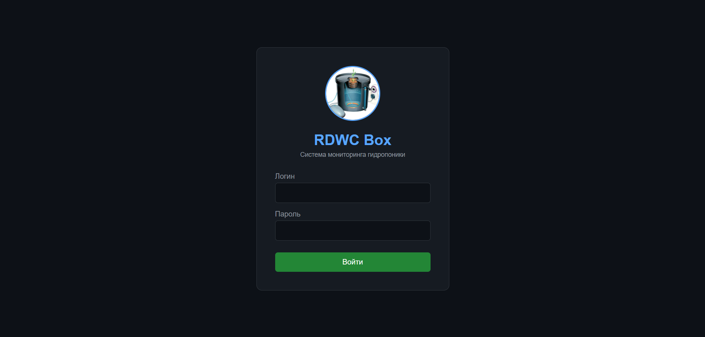
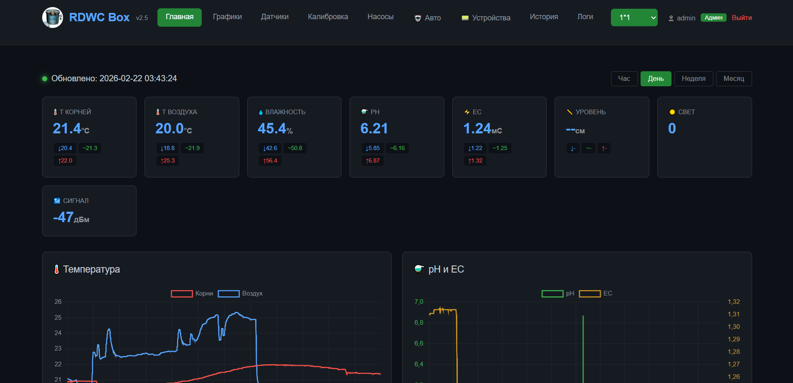
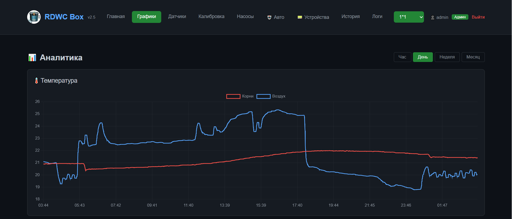
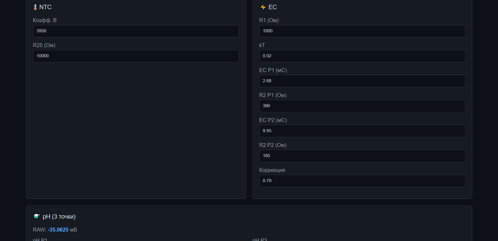
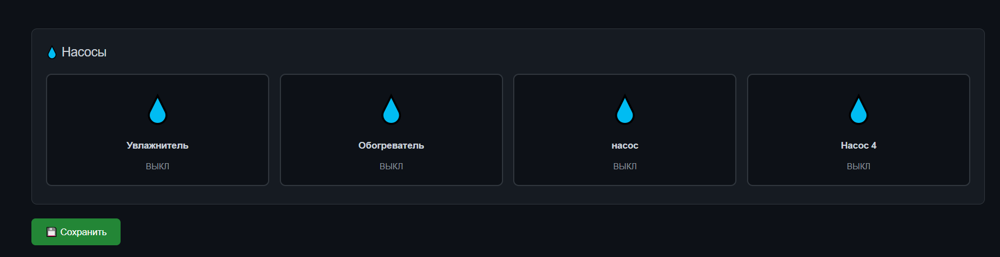
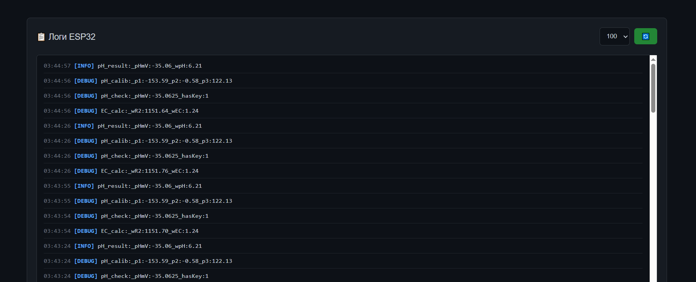

# RDWC Hydroponic Controller

<div align="center">

**Full-stack IoT system for hydroponic monitoring and automation**

[](https://www.espressif.com/)
[](https://php.net/)
[](https://mysql.com/)
[](https://telegram.org/)
[](LICENSE)

</div>

---

## Overview

RDWC Hydroponic Controller is a production-ready system for monitoring and managing Recirculating Deep Water Culture (RDWC) setups. It combines ESP32 firmware, a web dashboard, and a Telegram bot into one integrated platform.

**What it does:**
- Reads pH, EC, root temperature, air temperature, humidity, and solution level in real time
- Displays live data and historical charts on a responsive web dashboard
- Controls 4 dosing pumps remotely
- Sends alerts and accepts commands through a Telegram bot
- Streams device logs to the cloud for remote debugging

---

## Screenshots

| Login | Dashboard |
|-------|-----------|
|  |  |

| Charts | Calibration |
|--------|-------------|
|  |  |

| Pump Control | Device Logs |
|--------------|-------------|
|  |  |

---

## System Architecture

```
┌──────────────┐         ┌──────────────────────┐         ┌──────────────┐
│   Sensors    │         │       ESP32          │  HTTP   │  VPS Server  │
│              │──────── │                      │────────►│              │
│ pH, EC, Temp │  I2C /  │  Reads sensors       │         │ PHP + MySQL  │
│ Humidity     │ OneWire │  Posts JSON to API    │         │ REST API     │
│ Level        │         │                      │         │ Web Dashboard│
└──────────────┘         └──────────────────────┘         └──────┬───────┘
                                                                 │
                                                                 │ Webhook
                                                                 ▼
                                                          ┌──────────────┐
                                                          │ Telegram Bot │
                                                          │              │
                                                          │ Alerts       │
                                                          │ Commands     │
                                                          │ Monitoring   │
                                                          └──────────────┘
```

---

## Hardware

| Component | Purpose | Interface |
|-----------|---------|-----------|
| ESP32 DevKit | Main controller | — |
| DS18B20 | Root zone temperature | OneWire (GPIO 4) |
| AHT10/AHT20 | Air temperature + humidity | I2C (0x38) |
| MCP3421 | 18-bit ADC for pH probe | I2C (0x68) |
| MCP23017 | GPIO expander for pumps | I2C (0x20) |
| EC electrodes | Solution conductivity | ADC |
| HC-SR04 | Solution level (optional) | GPIO |

### Wiring

```
ESP32 Pin Map
─────────────────────────────────
GPIO 4        → DS18B20 (OneWire)
GPIO 21 (SDA) → I2C Bus
GPIO 22 (SCL) → I2C Bus
GPIO 34       → EC Electrode (Ap)
GPIO 35       → EC Electrode (An)

I2C Devices
─────────────────────────────────
0x38  AHT10   (temp + humidity)
0x68  MCP3421 (pH ADC)
0x20  MCP23017 (pump relays)
```

---

## Software Stack

| Layer | Technology | Description |
|-------|-----------|-------------|
| Firmware | C++ / PlatformIO | Sensor reading, HTTP posting, OTA |
| Backend | PHP 8.0 + MySQL 8.0 | REST API, data storage, auth |
| Frontend | HTML/CSS/JS + Chart.js | Responsive dashboard with charts |
| Bot | PHP (webhook) | Telegram alerts and commands |
| Server | Ubuntu + nginx | VPS hosting |

---

## API Endpoints

| Method | Endpoint | Description |
|--------|----------|-------------|
| GET | `/api.php?action=data` | Push sensor data from ESP32 |
| GET | `/api.php?action=log` | Push device log entry |
| GET | `/api.php?action=logs` | Fetch log history |
| GET | `/api.php?action=last` | Get latest readings |
| GET | `/api.php?action=pumps` | Get pump states |

---

## Quick Start

### 1. Server Setup

```bash
apt update && apt install -y nginx php-fpm php-mysql mysql-server

mysql -u root -p -e "
  CREATE DATABASE wegabox;
  CREATE USER 'wegabox'@'localhost' IDENTIFIED BY 'your_password';
  GRANT ALL PRIVILEGES ON wegabox.* TO 'wegabox'@'localhost';
"

git clone https://github.com/myseringan/RDWC-Hydroponic-Controller.git
cp -r server/* /var/www/wegabox/
mysql -u root -p wegabox < /var/www/wegabox/database.sql
chown -R www-data:www-data /var/www/wegabox
```

### 2. Flash ESP32

Edit `firmware/src/pre.h`:

```cpp
#define WIFI_SSID     "Your_WiFi"
#define WIFI_PASSWORD "Your_Password"
#define SERVER_URL    "http://your-domain.com/api.php"
#define API_KEY       "your_api_key"

// Enable sensors (1 = on, 0 = off)
#define c_DS18B20     1
#define c_AHT10       1
#define c_MCP3421     1
#define c_MCP23017    1
```

```bash
cd firmware
pio run --target upload
```

### 3. Telegram Bot

```bash
# Set your bot token in bot.php
# Configure webhook:
curl "https://api.telegram.org/bot<TOKEN>/setWebhook?url=https://your-domain.com/bot.php"
```

---

## Calibration

**pH** — 3-point calibration with buffer solutions (4.01, 6.86, 9.18). Submerge the probe, wait 2-3 minutes for stabilization, record the raw mV value, and enter it in the Calibration page.

**EC** — 2-point calibration with reference solutions (1.413 mS/cm and 2.76 mS/cm).

---

## Project Structure

```
RDWC-Hydroponic-Controller/
├── firmware/
│   ├── src/
│   │   ├── dev/              # Sensor drivers
│   │   │   ├── aht10/
│   │   │   ├── ds18b20/
│   │   │   ├── mcp3421/
│   │   │   └── mcp23017/
│   │   ├── main.cpp
│   │   ├── pre.h             # Configuration
│   │   └── cloudapi.h        # API client
│   └── platformio.ini
│
├── server/
│   ├── index.php             # Web dashboard
│   ├── api.php               # REST API
│   ├── bot.php               # Telegram bot
│   └── database.sql          # DB schema
│
├── screenshots/
└── README.md
```

---

## Troubleshooting

**ESP32 won't connect to WiFi** — Check SSID/password in `pre.h`. Make sure the router is on 2.4 GHz. Monitor serial output at 115200 baud.

**pH readings are wrong** — Run 3-point calibration. Check MCP3421 I2C connection. Make sure the probe is submerged.

**Telegram bot not responding** — Verify bot token. Webhook requires HTTPS. Check that your chat_id is in the allowed list.

**Web dashboard won't load** — Run `nginx -t && systemctl restart nginx`. Check file permissions. Review `/var/log/nginx/error.log`.

---

## Author

**Temur Eshmurodov** — [@myseringan](https://github.com/myseringan)

## License

MIT License — free to use and modify.
